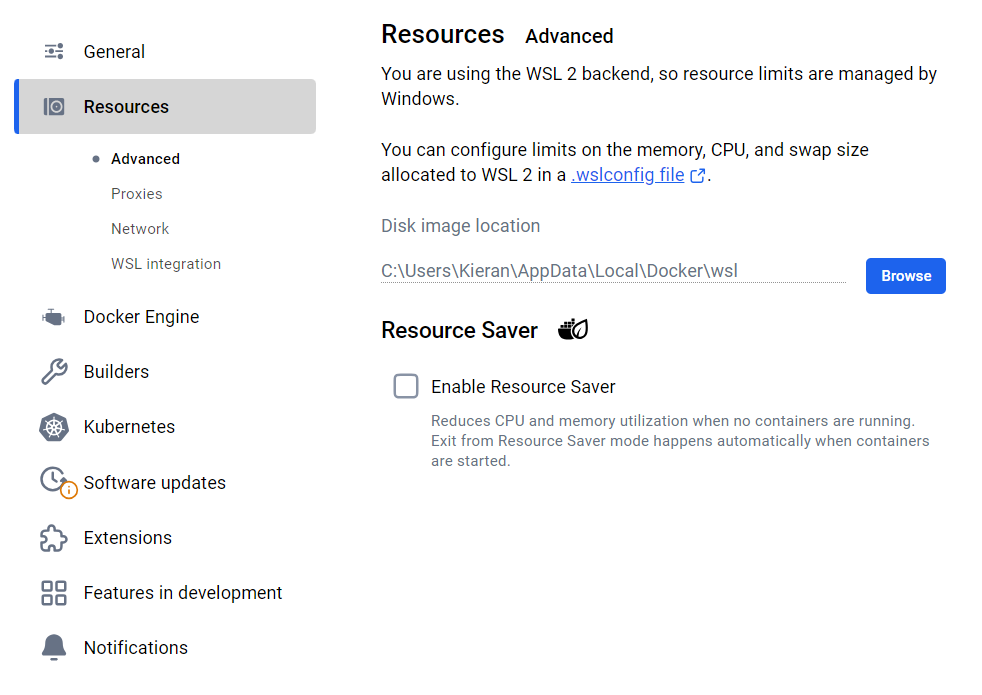

= Dotfiles

:link-devtools: https://github.com/kieranpotts/devtools
:link-bootstrap: https://github.com/kieranpotts/bootstrap
:link-gitscm: https://git-scm.com/
:link-gitforwindows: https://gitforwindows.org/
:link-gitlfs-install: https://github.com/git-lfs/git-lfs/blob/main/INSTALLING.md
:link-gitlfs-migrate: https://github.com/git-lfs/git-lfs/blob/main/docs/man/git-lfs-migrate.adoc
:link-github-lfs: https://docs.github.com/en/repositories/working-with-files/managing-large-files/about-large-files-on-github
:link-codespace-settings: https://github.com/settings/codespaces
:link-gitignore: https://git-scm.com/docs/gitignore
:link-ohmyposh: https://ohmyposh.dev/

These are my personal Unix dotfiles. They include:

* Handy shell aliases and functions for Unix-like systems.
* A better default configuration for Git.
* An extensive suite of useful Git aliases, eg. `git sync`, `git amend`, `git squash`, `git fixup`, `git undo`.

These dotfiles complement my {link-devtools}[devtools] – additional tools and configuration for use directly on Windows.

== Documentation

// TODO: Break up the documentation into multiple `./docs/*.adoc` files.

=== Requirements

These dotfiles are intended for use in Bash on Debian-based systems, but I've made some effort to make them as cross-platform compatible as possible. Most of the shell scripts are POSIX-compliant and will therefore run in all Unix shells. They can be used on Windows too, via a Linux emulator like {link-gitforwindows}[Git Bash for Windows] or a virtual machine like WSL.

On Debian systems, my {link-bootstrap}[bootstrap scripts] can be used to install all dependencies, so automating the following steps. For Git Bash on Windows, my {link-devtools}[devtools] repository bundles most of the required programs, but some of the below steps still need to be done manually.

==== REQUIRED programs

The only REQUIRED program is *Git*. The Git configuration has been tested with {link-gitscm}[Git] v2.39.1 and is expected to be compatible with versions after 2.35. For Debian distros, run the following command to check which is the current version of Git available via the APT package manager.

[source,sh]
----
apt-cache policy git
----

If the available version is ≥ v2.35, go ahead and install from the default package registry.

[source,sh]
----
sudo apt-get update
sudo apt-get install git -y
----

If you want to install a newer version of Git than is available via the package registry, use `wget` to download the source of the desired version. For example, to download the source for Git v2.35.0, run the following command.

[source,sh]
----
wget https://github.com/git/git/archive/refs/tags/v2.35.0.tar.gz
----

Before extracting the files from the archive, install the following packages.

[source,sh]
----
sudo apt-get update
sudo apt-get install libz-dev libssl-dev libcurl4-gnutls-dev libexpat1-dev gettext cmake gcc
----

Extract the source files for the Git package, then navigate to the extracted directory.

[source,sh]
----
tar -zxf v2.35.0.tar.gz
cd git-2.35.0
----

Run the following command to build and install the Git package. This is a slow operation.

[source,sh]
----
make prefix=/usr/local all
sudo make prefix=/usr/local install
----

Restart your terminal, then check the installed Git version with the command `git --version`. Use `rm` to clean-up the temporary files and directories created in this process.

==== OPTIONAL programs

It is RECOMMENDED to install Git Large File Storage (LFS). This is a Git extension that removes large files from Git repositories and stores them elsewhere, cross-referenced from the Git repositories using pointers. Git LFS is included in the distribution of {link-gitforwindows}[Git for Windows], while {link-gitlfs-install}[packages are available for popular Linux distributions]. Once installed, run the following command to set up Git LFS globally in your local Git instance:

[source,sh]
----
git lfs install
----

In each Git repository where you want to use Git LFS, run the following command to configure the file types that you'd like Git LFS to manage. Alternatively, you can edit the `.gitattributes` file directly (changes to this file MUST be committed).

[source,sh]
----
git lfs track "*.pdf"
----

Then commit and push as normal. To convert existing files previously committed to the repository use the `git lfs migrate` command. See the {link-gitlfs-migrate}[Git LFS documentation] for further instructions, and more {link-github-lfs}[about large files on GitHub].

Besides Git LFS, the following programs are also OPTIONAL:

* https://github.com/dandavison/delta[Delta]
* https://www.gpg4win.org/[GPG4Win]
* https://github.com/jesseduffield/lazygit#installation[LazyGit]
* https://github.com/neovim/neovim/blob/master/INSTALL.md[Neovim]
* https://ohmyposh.dev/docs/installation/linux[Oh-My-Posh]

GPG4Win is required for signing Git commits with a passphrase-protected private key. This must be installed and configured manually – instructions are below.

These dotfiles include configurations for LazyGit and Neovim, while Delta and Oh-My-Posh may be used to enhance Git and the terminal prompt, respectively. For Debian systems, you can use my {link-bootstrap}[bootstrap scripts] to install these programs, or follow the instructions from the links above to install manually. For Git Bash on Windows, most of these programs are bundled with my {link-devtools}[devtools] – except for Neovim, which is not available as a standalone binary.

==== Other requirements

If using Docker Desktop for Windows with the WSL back-end, it is RECOMMENDED to disable Docker's resource saver feature, as it is known to https://github.com/docker/for-win/issues/14656[freeze WSL].

=== Installation

To install these dotfiles, fork-and-clone the upstream repository to any location on your local machine, then follow the steps below. This process needs to be repeated for each environment – so, once for WSL and once for Git Bash, if using both on the same Windows machine.

==== 1. Run the `./install.sh` script

Change to the root directory of the cloned repository and run the `./install.sh` shell script.

IMPORTANT: For Git Bash on Windows, run the terminal program as administrator.

[source,sh]
----
cd /path/to/dotfiles
sh install.sh
----

The first time you run this, you will need to exit your terminal program then restart it. Doing so will create a new login shell, which will load the newly-installed dotfiles at startup.

The `install.sh` script can be safely run multiple times, and it is RECOMMENDED to re-run it whenever you `git pull` the latest changes from the upstream dotfiles repository, so that any new symlinks are created as required.

==== 2. Add the `bin/*` directories to your system PATH environment variable

This repository's `bin` directory contains various `git-*` shell scripts that are mapped to Git aliases. It is RECOMMENDED you add the `bin` directory to your system PATH environment variable, to make these Git commands available from the command line.

For Bash on Unix, this is done automatically via configuration in the global `.bashrc` file. To make the Git aliases available in the Git Bash emulator on Windows, you will need to manually update Windows' PATH environment variable.

==== 3. Create symlinks to the configuration files

Configuration files are included for various command line development tools. To use these configurations, symlinks must be created to them from the filesystem locations the programs expect them to be. The `./install.sh` script does this automatically for non-Windows environments. To use the LazyGit, Neovim and tmux configurations in Git Bash for Windows, run Windows Powershell in administrator mode and execute the following commands, changing the filesystem paths as required.

[source,powershell]
----
# LazyGit
New-Item -ItemType SymbolicLink `
  -Path "C:\Users\[User]\AppData\Roaming\lazygit\config.yml" `
  -Target "C:\path\to\dotfiles\etc\lazygit\config.yml" `
  -Force

# Neovim
New-Item -ItemType SymbolicLink `
  -Path "C:\Users\[User]\AppData\Local\nvim\init.vim" `
  -Target "C:\path\to\dotfiles\etc\nvim\init.vim" `
  -Force

# tmux
New-Item -ItemType SymbolicLink `
  -Path "C:\Users\[User]\.tmux.conf" `
  -Target "C:\path\to\dotfiles\etc\tmux\tmux.conf" `
  -Force
New-Item -ItemType SymbolicLink `
  -Path "C:\Users\[User]\.tmux\dev" `
  -Target "C:\path\to\dotfiles\etc\tmux\inc\dev" `
  -Force
----

==== 4. GitHub Codespaces configuration

The `./install.sh` script can be used to bootstrap your GitHub Codespaces environments, too. Only a subset of the dotfiles configuration are enabled in Codespaces – limited only to Bash aliases and functions at this time. Go to your {link-codespace-settings}[GitHub Codespaces options] and enable the following setting.

image::./_/github-automatically-install-dotfiles.png[]

=== Configuration

The `./install.sh` script will have established various symlinks in your home directory for the Unix dotfiles. For example, `~/.gitconfig` will be symlinked to `/path/to/dotfiles/dist/global.gitconfig`.

IMPORTANT: You SHOULD NOT change the dotfiles symlinks (eg. `~/.gitconfig`) or edit the contents of their target files in this repository's `dist` directory. Instead, you can make changes to your dotfiles configuration via the "local" files that have been added to your home directory – as explained below.

The following files will be added to your home directory.

* `~/local.profile`
* `~/local.bash_profile`
* `~/local.bashrc`
* `~/local.gitconfig`
* `~/local.gitignore`
* `~/local.gitmessage`

These are _not_ symlinked and they are not kept under version control, either. Therefore, you can safely edit these files to make configuration changes in each individual environment in which you have installed these dotfiles. It's via these "local" files that you extend the "global" dotfiles configurations shared via this repository.

[TIP]
=====
Whenever you make changes to any of the "local" shell startup scripts – `~/local.bashrc`, `~/local.bash_profile`, or `~/local.profile` – you can call the `reload!` function to re-source the shell startup scripts, so your changes take effect immediately without needing to restart the shell session.

[source]
----
reload!
----
=====

If you already had files like `.profile` or `.gitconfig` in your user directory, the `./install.sh` script will have created backups of these files before replacing them. The backup files will be named with the "backup" prefix. For example, your existing `~/.bashrc` file will have been renamed `~/backup.bashrc`. You may need to manually copy-and-paste existing configurations from the old "backup" files to the new "local" files.

==== Git configuration

You MUST edit the `~/local.gitconfig` file to configure your Git user profile information. This data will be embedded in commit objects:

[source,ini]
----
[user]
  email = you@example.com
  name = Your Name
----

[TIP]
======
GitHub provides free aliases for your GitHub account's email address, to help keep your personal email address private. You can enable this via your GitHub account's email settings. If you have a GitHub email alias, you should use that in the `email` field in your local Git config.
======

When you ran the `./install.sh` script, your previous Git configuration would have been backed up to `~/backup.gitconfig`. You SHOULD review the contents of this file and copy any other configuration you wish to keep to the new `~/local.gitconfig` file.

NOTE: From now on you SHOULD NOT use the `git config --global` command to update your Git configuration. If you do, this command will update the file symlinked from `~/.gitconfig`. To avoid this, you SHOULD instead directly edit the `~/local.gitconfig` file.

You MAY also edit the `~/local.gitignore` file to configure global {link-gitignore}[Git ignore rules]. By default, this file adds rules to ignore files or directories named `\__TODO__`, `\__NOTES__` or `\__SCRIPTS__` in any Git repository anywhere on your local filesystem. It means the contents of these paths will be private to you and will not be committed to source control.

==== Git configuration: signing Git commits

Some manual configuration steps are required if you want to sign your Git commits using a GnuPG (aka. GPG) key.

To set this up, first check if you already have a GPG key pair:

----
$ gpg --list-secret-keys --keyid-format=long
----

The key ID is the bit on the `sec` line after the first `/`:

----
sec   <key-type>/<key-id> <creation-date>
----

In the following example, the key ID is `3AA5C34371567BD2`:

----
sec   rsa4096/3AA5C34371567BD2 2025-09-15 [SC]
      C142F66F50AC8C832C8CF7553AA5C34371567BD2
----

If you don't already have a GPG key, create one with the following command.

----
$ gpg --full-generate-key
----

At the prompts, choose RSA, 4096 bits, and optionally set an expiration time. For your uid, use the same email address you use to create Git commits that will be pushed to GitHub/GitLab. If you use a private email aliases provided by GitHub, use that.

Optionally, you can set a passphrase to protect your private key. If you set a passphrase, you'll need to enter it each time you use the key (though the GPG agent will cache passphrases for a while).

If you set a passphrase for your key, add the following line to your `~/local.bashrc`. This tells GPG to use the current terminal for passphrase prompts. When committing to a Git repository, you will be prompted for your GPG key's passphrase via a prompt with the CLI.

----
export GPG_TTY=$(tty)
----

Before adding the GPG key to your Git config, check that you've configured your key correctly. You can do this by using it to sign an arbitrary piece of text:

----
echo "test" | gpg --clearsign
----

You should be prompted for your GPG key's passphrase (if set) and you will see the signed text output.

Now add the following to your `~/local.gitconfig` file, replacing `<key-id>` with your actual key ID.

----
[user]
  signingkey = <key-id>
----

You can now sign commits and tags on a case-by-case basis:

----
git commit -S -m "Your commit message"
git tag -s v1.0 -m "Version 1.0"
----

Once you've verified this works as expected, you can make this the default behavior for all commits. In `~/local.gitconfig`:

----
[commit]
  gpgsign = true
----

Finally, before you push any signed commits, you need to export your public key, and copy the output into your GitHub/GitLab account (in Settings → SSH and GPG keys). Once set up, a "verified" badge will be shown next to your signed commits in the upstream repository's GUI.

----
$ gpg --armor --export <key-id>
----

The above configuration works fine when using Git exclusively in the WSL environment. But if you are committing from a Windows GUI client (eg. VS Code's built-in Git client, or GitHub Desktop), you will need some additional configuration so that you are prompted for your GPG key's passphrase via the Windows GUI. The solution is to download and install https://www.gpg4win.org[GPG4Win], and configure Git in WSL to use GPG4Win's `gpg.exe` Windows binary, rather than the `gpg` binary installed in WSL.

In WSL, create a wrapper script for GPG4Win's `gpg.exe`:

----
$ sudo vim /usr/local/bin/gpg
----

Add the following contents:

----
#!/bin/bash

/mnt/c/Program\ Files\ \(x86\)/GnuPG/bin/gpg.exe "$@"
----

Make it executable:

----
$ sudo chmod +x /usr/local/bin/gpg
----

Configure Git to use the wrapper script instead of the default `gpg` binary. In `~/local.gitconfig`:

----
[gpg]
  program = /usr/local/bin/gpg
----

Export your GPG key pair from WSL, and import the keys into GPG4Win:

----
$ gpg --armor --export-secret-keys YOUR_EMAIL > private.key
$ gpg --armor --export YOUR_EMAIL > public.key
----

Copy the files to somewhere on the Windows filesystem.

Open Kleopatra (an OpenPGP certificate and key management utility that is installed with GPG4Win). Go to *File -> Import Certificates*, and import both the `public.key` and `private.key` files you exported from WSL. The key should now be listed in Kleopatra, under *Certificates*.

Alternatively, you can import the keys via the command line:

----
cd C:\path\to\your\keys

# Import private key first (this usually imports the public key too)
"C:\Program Files (x86)\GnuPG\bin\gpg.exe" --import private.key

# Import public key (if needed)
"C:\Program Files (x86)\GnuPG\bin\gpg.exe" --import public.key
----

Verify the import:

----
# List secret keys
"C:\Program Files (x86)\GnuPG\bin\gpg.exe" --list-secret-keys

# List public keys
"C:\Program Files (x86)\GnuPG\bin\gpg.exe" --list-keys
----

[IMPORTANT]
======
Delete the original `public.key` and `private.key` files after importing them to GPG.
======

To test the configuration, make a commit from a Windows GUI Git client, and you should be prompted for your GPG key's passphrase via a Windows GUI "pinentry" dialog. Also test via WSL, using either of the below commands; you should get the same Windows GUI pinentry dialog, rather than the original terminal prompt, for your passphrase.

----
# Sign an arbitrary piece of text.
echo "test" | gpg --clearsign

# Create a signed commit (may be empty).
git commit --allow-empty -m "test signed commit"
----

[TIP]
======
Your passphrase is held in memory by the GPG agent. You need to restart the agent to clear the cached passphrase. For the native Linux agent you would use:

----
$ gpgconf --kill gpg-agent
----

But of course you're now using the Windows agent, so you need to issue the following command from Powershell or the regular Command Prompt:

----
taskkill /f /im gpg-agent.exe
----

On the next GPG command, it will take a few seconds for the agent to startup, and then you will be prompted for your passphrase again.

You can use Kleopatra to manage your GPG configuration. For example, to adjust the period of time that your key passphrases are "remembered" for, go to *Settings > Configure Kleopatra > GnuPG System > Private Keys*. Locate the *Expire cached PINS after N seconds* and *Set maximum PIN cache lifetime to N seconds* settings, and adjust their values to your desired duration (in seconds). For instance, 86400 seconds is equivalent to one day.
======

It is RECOMMENDED to start the GPG agents automatically when you log in to Windows, otherwise the pinentry dialog may not appear when you first try to sign a commit from a Git GUI running on the Windws host, like VS Code. To do this, create shortcuts to the `gpg-agent.exe` and `gpg-connect-agent.exe` files in `C:\Program Files (x86)\GnuPG\bin` from your Windows startup folder (press `Win+R` then type `shell:startup` to open the folder).

==== Prompt themes

A couple of different solutions for customizing the command line prompt are included with these dotfiles.

The first solution depends on {link-ohmyposh}[Oh-My-Posh], a cross-platform prompt theming framework. It means the prompt theme can be used in Powershell, Git Bash, WSL, and other shells. The theme is enabled via the following command in the `~/local.bashrc` file. You just need to uncomment the line to enable it.

[source,sh]
----
eval "$(oh-my-posh init bash --config ~/.prompt-themes/oh-my-posh/ocean.omp.json 2> /dev/null)"
----

Then either restart the terminal or call the `reload!` function to re-source the shell startup scripts.

Alternatively, you can enable the `git-prompt.sh` or `git-prompt-simple.sh` scripts, both of which add Git repo information to the standard prompt line. Uncomment the following lines in the `~/local.bashrc` file, instead.

[source,sh]
----
source ~/.prompt-themes/git-prompt.sh
export PS1='\[\033[01;32m\]\u@\h\[\033[00m\]:\[\033[01;34m\]\w\[\033[01;31m\]$(__git_ps1)\[\033[00m\]\$ '
GIT_PS1_SHOWDIRTYSTATE=1
GIT_PS1_SHOWUPSTREAM="auto"
GIT_PS1_UPSTREAMEQUALS=""

# Or:
source ~/.prompt-themes/git-prompt-simple.bash
----

=== Usage

==== Shell environment variables

The following environment variables are enabled.

[cols="1,1,1"]
|===
|Name |Description |Shells

|`X_GIT_COMMIT_VERIFY=1`
|Change to `0` to apply `--no-verify` flag to `git commit` operations done via the Git aliases.
|Bash
|===

In addition, in Bash the `PATH` environment variable is extended to include `$HOME/bin` and `/path/to/dotfiles/bin`, if those directories exist.

==== Shell aliases

The following shell aliases are enabled.

[cols="1,2,3,1"]
|===
|Alias |Command |Description |Compatibility

|`..`
|`cd ..`
|Change up one directory.
|POSIX

|`\...`
|`cd ../..`
|Change up two directories.
|POSIX

|`\....`
|`ch ../../..`
|Change up three directories.
|POSIX

|`\.....`
|`cd ../../../..`
|Change up four directories.
|POSIX

|`egrep`
|`egrep --color=auto`
|Enable colorized output by default.
|POSIX

|`fgrep`
|`fgrep --color=auto`
|Enable colorized output by default.
|POSIX

|`g`
|`git`
|Shortcut for the oft-typed `git` command.
|POSIX

|`grep`
|`grep --color=auto`
|Enable colorized output by default.
|POSIX

|`l`
|`ls -laF --color`
|List all files (including hidden ones) in long-form.
|POSIX

|`ld`
|`ls -laF --color \| grep --color=never '^d'`
|List only directories.
|POSIX

|`lf`
|`ls -laF --color \| grep --color=never '^-'`
|List only files.
|POSIX

|`ls`
|`ls --color`
|Enable colorized output by default.
|POSIX

|`mkdir`
|`mkdir -p`
|Make directories recursively by default.
|POSIX

|`reload!`
|`. ~/.bashrc`
|Reload the Bash shell startup scripts.
|Bash

|`s`
|`sudo`
|Shortcut for `sudo` ("superuser do").
|POSIX
|===

==== Shell functions

The following shell functions are enabled.

[cols="1,3,1"]
|===
|Function |Description |Compatibility

|`buildDockerImage ([name_for_created_image])`
|Build a Docker image from a Dockerfile in the current directory.
|POSIX

|`runDockerContainer [image_name]`
|Run a Docker container from an image.
|POSIX

|`runDockerFromFile ([name_for_created_image])`
|Build an image and immediately run a container in the background from it.
|POSIX

|`listDockerImages`
|List all available docker images.
|POSIX

|`sshDockerContainer [container_id]`
|SSH into a running container.
|POSIX
|===

==== Git config

The `.gitconfig` file modifies Git's default behavior in the following ways:

* `git merge` always records explicit merge commits (ie. `--no-ff` is the default).

* `git fetch` automatically prunes refs to non-existent upstream branches and deletes non-existent tags.

* `git pull` rebases by default.

* `--autosquash` rules are automatically applied on rebase operations.

* `git push` pushes new tags, as well as new commits.

* Upstream branches are tracked automatically, and tracked branches are constrained to have the same names.

* Opts-out of security checks for Git repositories on external storage devices (`safe.directory`).

==== Git aliases

50+ Git aliases are included with these dotfiles. These extend Git's built-in operations, providing shortcuts for common Git workflows. All the Git aliases are implemented as shell scripts in the `bin` directory. For the aliases to work, the `bin` directory MUST be added to your system path.

To see what aliases are available, run the command `git aliases` – itself an alias! – in your terminal.

WARNING: Some of the operations enabled via the Git aliases are potentially destructive. For example, some Git aliases rewrite commit histories.

''''

Copyright © 2020-present Kieran Potts, link:./LICENSE.txt[MIT license]

*Third-party components*: These dotfiles integrate the following third-party
components:

* https://raw.githubusercontent.com/git/git/master/contrib/completion/git-completion.bash[Git Bash completion script]
* https://github.com/necolas/dotfiles/blob/master/shell/bash_prompt[Nicolas Gallagher's Bash prompt]

*Acknowledgments*: For the custom scripts and configuration, inspiration has been taken – and, in some cases, code shamelessly copied – from some of these related projects:

* https://dotfiles.io/[Sebastien Rousseau's dotfiles.io]
* https://github.com/thoughtbot/dotfiles[Thoughtbot's dotfiles]
* https://github.com/durdn/cfg[Nicola Paolucci's dotfiles]
* https://github.com/skwp/dotfiles[YADR – Yet Another Dotfile Repo]
* https://github.com/codeforester/base[Ramesh Padmanabhaiah's Base framework]
* https://github.com/haacked/dotfiles[Phil Haack's dotfiles]
* https://github.com/michaelbiven/dotfiles[Michael Biven's dotfiles]
* https://github.com/necolas/dotfiles[Nicolas Gallagher's OS X dotfiles]
* https://github.com/codespaces-contrib/dotfiles[GitHub Codespaces examples dotfiles]
* https://git.wiki.kernel.org/index.php/Aliases[Git Wiki: Aliases]
