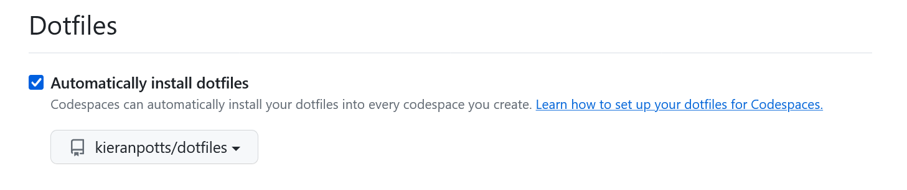

= Installation

WARNING: Some of the operations enabled by the dotfiles are potentially destructive. For example, some Git aliases rewrite commit histories. If you choose to use these dotfiles, you do so at your own risk.

Follow these steps to install the dotfiles on a new computer for the first time. After installing, follow the instructions for link:./configuration.adoc[configuring] and link:./updating.adoc[updating] the dotfiles.

== 1. Clone this repository

You should clone this repository directly into your user home directory.

[source,sh]
----
git clone git@github.com:kieranpotts/dotfiles.git
----

Alternatively, after cloning the repository elsewhere, create a link to it from `~/dotfiles`.

[source,sh]
----
ln -s /path/to/dotfiles ~/dotfiles
----

On Windows, use Powershell running with Administrator privileges.

[source,powershell]
----
New-Item -ItemType SymbolicLink -Path "C:\Users\[Username]\dotfiles" -Target "C:\path\to\dotfiles" -Force
----

== 2. Run the update script

Change to the root directory of the cloned repository and run the `bin/update!` shell script. If your OS is Windows, your terminal program MUST be run with administrator privileges in order for the script to be able to create the necessary symlinks.

[source,sh]
----
cd dotfiles
sh bin/update!
----

The update script will install and enable the dotfiles configuration. The first time you do this, you will need to exit your terminal program then restart it. Doing so will create a new login shell, which will load the newly-installed dotfiles configuration at startup.

== 3. Add the `bin` directory to your system PATH environment variable

This repository's `bin` directory contains various `git-*` shell scripts that are mapped to Git aliases. It is RECOMMENDED you add the `bin` directory to your system PATH environment variable, which will make these Git commands available from the command line. In Unix-like environments, add the following to your `local.bash_profile` file, changing the path as required:

[source,sh]
----
# Include the directory of Git alias scripts.
export PATH=$PATH:/path/to/dotfiles/bin
----

== 4. GitHub Codespaces configuration (optional step)

Go to your https://github.com/settings/codespaces[GitHub Codespaces options] and enable the following setting. This will ensure your terminal environment in github.dev will be consistent with your local terminal.

