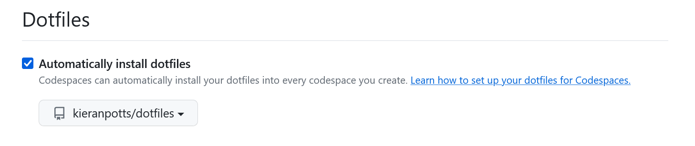

= Installation

To install, repeat the below steps for each environment. If using both Git Bash and WSL on the same machine, these steps need to be repeated for both.

IMPORTANT: For WSL and Git Bash, run the terminal program with administrator privileges. This is required for the script to create the necessary symlinks.

== 1. Fork and clone

If you are not a maintainer, first fork this repository to your own GitHub account. Clone the upstream repository to your local machine.

[source]
----
git clone git@github.com:<user_or_org>/dotfiles.git
----

You should clone the repository directly into your user home directory. Alternatively, clone the repository elsewhere, then create a symlink to it from `~/dotfiles`. For WSL and Unix-like systems, use the following command.

[source]
----
ln -s /path/to/dotfiles ~/dotfiles
----

For the Git Bash emulator and other Windows shells, use Powershell running with Administrator privileges, and run the following command.

[source]
----
New-Item -ItemType SymbolicLink -Path "C:\Users\[Username]\dotfiles" -Target "C:\path\to\dotfiles" -Force
----

== 2. Run the `update!` script

Change to the root directory of the cloned repository and run the `bin/update!` shell script.

[source]
----
cd ~/dotfiles
sh bin/update!
----

The update script will install and enable the dotfiles. The first time you do this, you will need to exit your terminal program then restart it. Doing so will create a new login shell, which will load the newly-installed dotfiles at startup.

== 3. Add the `bin/*` directories to your system PATH environment variable

This repository's `bin` directory contains various `git-*` shell scripts that are mapped to Git aliases. It is RECOMMENDED you add the `bin` directory to your system PATH environment variable, to make these Git commands available from the command line.

For Unix shells, the `local.profile` file already includes a script to add `~/dotfiles/bin` to the `PATH` environment variable. On Windows, the PATH needs to be updated manually, to make the Git aliases available in the Git Bash emulator.

=== 4. Enable the shell theme

A custom prompt theme is included. It is a fork of the popular Agnoster theme, which is included with Oh-My-Posh, a cross-platform prompt theming framework for Powershell, Git Bash, WSL, and other shells.

The theme is enabled via the following command in the `~/local.bash_profile` file. You just need to uncomment the line to enable it.

[source]
----
eval "$(oh-my-posh init bash --config ~/dotfiles/etc/oh-my-posh/themes/ocean.omp.json 2> /dev/null)"
----

Either restart the terminal or call the `reload!` function to re-source the shell startup scripts.

Change the `--config` parameter to load different themes. More themes can be installed by running the commands below.

[source]
----
mkdir [path/to/install/dir]
cd [path/to/install/dir]
wget https://github.com/JanDeDobbeleer/oh-my-posh/releases/latest/download/themes.zip -O themes.zip
unzip themes.zip
chmod u+rw *.json
rm themes.zip
----

NOTE: `wget` is not pre-installed in the Git Bash emulator. I've included the Windows binary in my link:https://github.com/kieranpotts/devtools[devtools] repository.

****
Oh My Posh is highly customizable. See https://ohmyposh.dev/docs/[the website] for more options. As a cross-platform framework, configurations can be shared between shells. So you can expose your Powershell, Git Bash and WSL environments to the same configuration, ensuring a consistent prompt in every shell environment running in every terminal program.
****

Alternatively, you can enable the `git-prompt.sh` file, which adds Git repo information to the standard prompt line. Uncomment the following line in the `~/local.bash_profile` file, instead.

[source]
----
source ~/dotfiles/lib/git-prompt.sh
----

////
TODO: Add docs for configuring PowerShell, eg to use same Oh-My-Posh config
////

=== 5. Create symlinks to the configuration files

Configuration files are included for various command line development tools. To use these configuration, you will need to create symlinks to them.

.WSL and UNIX-like systems
[source]
----
# LazyGit
ln --symbolic --force /full/path/to/dotfiles/etc/lazygit/config.yml ~/.config/lazygit/config.yml

# Nvim
mkdir -p ~/.config/nvim
ln --symbolic --force /full/path/to/dotfiles/etc/nvim/init.vim ~/.config/nvim/init.vim
----

On Windows, run Windows Powershell in administrator mode and execute the following commands, changing the filesystem paths as required.

.Windows (required for Git Bash)
[source]
----
# LazyGit
New-Item -ItemType SymbolicLink -Path "C:\Users\[User]\AppData\Roaming\lazygit\config.yml" -Target "C:\path\to\dotfiles\etc\lazygit\config.yml" -Force

# Neovim
New-Item -ItemType SymbolicLink -Path "C:\Users\[User]\AppData\Local\nvim\init.vim" -Target "C:\path\to\dotfiles\etc\nvim\init.vim" -Force
----

== GitHub Codespaces configuration

Go to your https://github.com/settings/codespaces[GitHub Codespaces options] and enable the following setting. This will ensure your terminal environment in Codespaces will be consistent with your local terminal.

